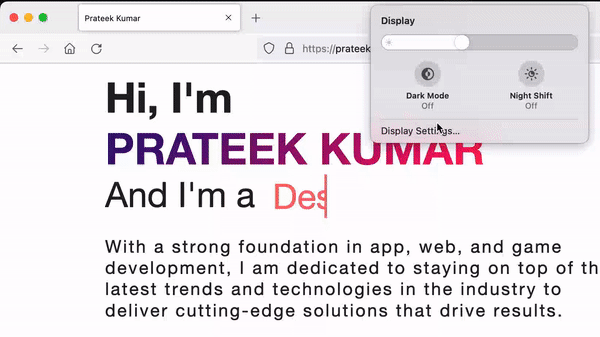

# Personal Portfolio Website

<a href="https://prateekkhohal.github.io/" align="center">VISIT WEBSITE</a>

## Welcome to my portfolio website!

#### *This website is fully responsive and optimized for all devices, so you can access it from anywhere, at any time. It has been designed and developed to showcase my skills, experience, and achievements.*

## OS Theme Adaptability

#### *One unique feature of this website is that it changes its theme automatically based on the user's OS theme. So, if you have a dark mode enabled on your device, the website will switch to a dark mode theme, and if you have a light mode enabled, it will switch to a light mode theme. This makes the website more user-friendly and accessible, as it adapts to the user's preferences.*

## Live Demo

  

#### *The website includes my professional background, education, skills, and previous work experience, as well as a portfolio of my projects. You can browse through my projects and view detailed descriptions, screenshots, and links to live demos or repositories.*

#### *I have also included a contact form, which you can use to get in touch with me if you have any questions, inquiries, or collaboration opportunities.*

## Thank you for visiting my portfolio website, and I hope you enjoy browsing through it.

#### *If you have any feedback or suggestions on how I can improve my website, please don't hesitate to let me know. I am always looking for ways to enhance my skills and improve the user experience for my visitors.*

#### *In addition to the above, I have made sure that this website is fully optimized for search engines, so that potential clients or employers can easily find me online.*
